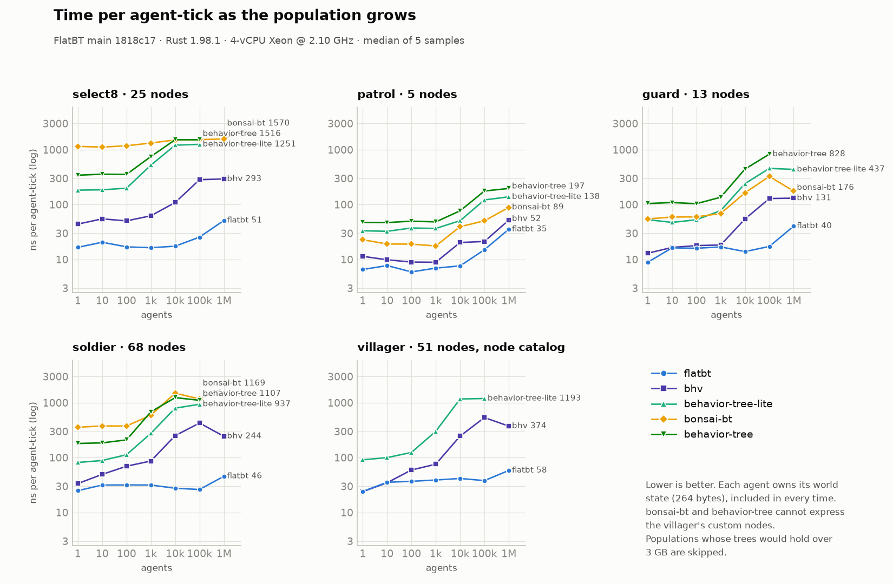
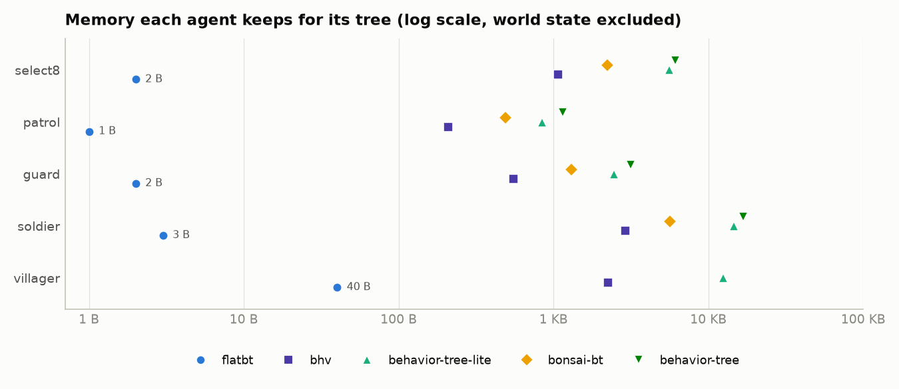

# Comparison with other Rust behavior tree crates

A standalone crate, outside the workspace, that runs the same trees on FlatBT
and four other crates and measures time, instructions, allocation and memory.

```sh
cd benchmarks
cargo run --release                      # full run, ~4 minutes
cargo run --release -- --quick           # shorter samples
cargo run --release -- --scenario guard --lib bhv
./instructions.sh                        # cachegrind; needs valgrind
csharp/compare.sh                        # against bt-tree (C#); needs .NET 10
cargo run --release -- scaling > charts/scaling.tsv   # 1 to 1M agents, ~40 minutes
python3 charts/plot.py charts/scaling.tsv charts/     # needs matplotlib
```

The run exits non-zero if any library's results differ from FlatBT's.

## Libraries

| Crate | Version | Model |
| --- | --- | --- |
| flatbt | this repository | Static dispatch, one shared tree, per-agent state inline |
| [bonsai-bt](https://crates.io/crates/bonsai-bt) | 0.14.0 | `Behavior` enum tree; `BT` owns a clone and rebuilds child state from it on each transition |
| [behavior-tree](https://crates.io/crates/behavior-tree) | 0.1.0 | `Rc<RefCell<Node>>` tree, state in the nodes |
| [bhv](https://crates.io/crates/bhv) | 0.4.0 | `Box<dyn Bhv>` tree, state in the nodes |
| [behavior-tree-lite](https://crates.io/crates/behavior-tree-lite) | 0.3.2 | `Box<dyn BehaviorNode>` containers after BehaviorTree.CPP; agent data through a `dyn Any` callback |

Left out: Bevy plugins (`bevy_behave`, `bevior_tree`), whose cost is the ECS
around them; `behaviortree-rs`, an async BehaviorTree.CPP port; `forester-rs`, a
DSL interpreter.

## Method

Every library runs the same trees over the same blackboard and the same
leaf function, [`Op::run`](src/common.rs). A tick advances a small
deterministic world, then ticks the tree once. After 100k ticks each library's
blackboard and Success/Failure/Running counts must equal FlatBT's; all do.
bonsai-bt and behavior-tree have a closed set of node kinds, so they run the
first four trees only.

| Scenario | Tree | Shape of the work |
| --- | --- | --- |
| `select8` | `select` of 8 × `seq(is_mode(i), act(i))` | Completes every tick; condition scan with an unpredictable winner |
| `patrol` | `seq(move_to(8), act, move_to(-8), act)` | Running 97% of ticks; resumes the active child |
| `guard` | `select(seq(low_hp, move_to(0), heal), seq(enemy, attack), patrol)` | Three levels; mostly resuming, some rescans |
| `soldier` | A game NPC, below: 68 nodes, 43 leaves, depth 7 | A realistic mix of rescans, resumes and aborts |
| `villager` | Needs by utility, below: 51 nodes, 28 leaves, depth 7 | FlatBT's node catalog: orders, repeats, decorators |

`soldier` ([source](src/soldier.rs)) is ordered by priority. Its world spawns
enemies that shoot back and close in, makes noises, and raises hunger and
fatigue every tick:

```text
select
├─ seq  dead? → respawn (20 ticks)
├─ seq  low health? → select
│        ├─ seq  has medkit? → use medkit (3)
│        ├─ seq  enemy visible? → go to cover → regenerate (6)
│        └─ seq  go to base → regenerate (6)
├─ seq  enemy visible? → select
│        ├─ seq  magazine empty? → select
│        │        ├─ seq  has reserve? → reload (4)
│        │        ├─ seq  enemy close? → melee (3, fails if enemy gone)
│        │        └─ seq  go to ammo → take ammo
│        ├─ seq  enemy in range? → select
│        │        ├─ seq  has grenade? → enemy grouped? → throw
│        │        └─ seq  aim (2, fails if enemy gone) → fire
│        └─ close in (fails if enemy gone)
├─ seq  heard noise? → go to noise* → look around (3)* → clear noise
├─ seq  hungry? → select
│        ├─ seq  has food? → eat (5)*
│        └─ seq  go to kitchen* → take food
├─ seq  tired? → go to bed* → sleep (12)*
└─ seq  patrol: go to 12* → look (3)* → go to -12* → look (3)* → go to 0* → lap done
                                                  * fails when an enemy appears
```

Over 100k ticks the soldier fires 3,131 shots, reloads 345 times, throws 98
grenades, uses 98 medkits, eats 214 times, sleeps 116 times, completes 585
patrol laps and respawns 48 times. The run prints the full mix.


`villager` ([source](src/villager.rs)) exercises FlatBT's node catalog. Needs
grow every tick, threats come and go, and every random choice draws from one
seeded generator on the blackboard:

```text
select
├─ seq  threat? → if_else(healthy?)
│        ├─ then: seq  repeat(3, swing (2, fails if threat gone))
│        │             → force_success(seq  loot? → take loot)
│        └─ else: seq  invert(cornered?) → go to safety → hide (4)
└─ utility by need score (per_child!)
         ├─ hunger:  seq  retry(3, forage: 2 in 3 by draw) → go to kitchen*
         │                → repeat(2, chew (3)*) → eat
         ├─ fatigue: seq  go to bed* → repeat_while(tired?, rest (2)*)
         ├─ boredom: weighted_select by friendship (per_child!)
         │           ├─ seq  friend 0 home? → go to friend 0* → chat (3)*
         │           ├─ … friend 1
         │           └─ … friend 2
         └─ duty:    shuffle_seq
                     ├─ seq  go to woodpile* → chop (2)*
                     ├─ seq  go to well* → carry water (2)*
                     └─ seq  go to hall* → sweep (2)*
                                          * fails when a threat appears
```

Over 100k ticks the villager swings 4,080 times, loots 659 times, hides 63
times, eats 765 meals, rests 952 times, chats about 260 times with each friend
and does about 330 of each chore, from 7,231 random draws.

No other crate here ships utility, weighted or shuffled selection, so bhv and
behavior-tree-lite get them as custom nodes written against their public node
traits, with FlatBT's selection algorithms ported exactly (`Order::next` in
[`src/common.rs`](src/common.rs)); `repeat`, `retry`, `if_else` and
`repeat_while` likewise. Their own inverter and force-success nodes match
FlatBT's and are used as they are.

| FlatBT | bonsai-bt | behavior-tree | bhv | behavior-tree-lite | bt-tree (C#) |
|---|---|---|---|---|---|
| `utility`, `by_score` | — | — | — | — | — |
| `random_select`, `shuffle_seq`, `weighted_select` | — | — | — | — | — |
| `if_else` | `If` | `Cond` | — | `if` | — |
| `invert`, `force_success`, `force_failure` | `Invert`, `AlwaysSucceed` | — | `Inv`, `Pass`, `Fail` | `Inverter`, `ForceSuccess`, `ForceFailure` | `Optional` |
| `repeat`, `retry` | — | — | `Repeat`, `RepeatUntilPass` (different counting) | `Repeat`, `Retry` (count from a blackboard port) | `RepeatUntilSuccess` |
| `repeat_while`, `guard` | `While` | `While` | `RunIf`, `RepeatUntil` | — | `While` |

In Rust, utility and random selection exist only in Bevy plugins:
`bevior_tree`'s score- and random-ordered sequences and selectors, `gamai`'s
`UtilitySelector`, `bevy_thinker`. Their cost is the ECS around them, so they
are not measured here.

Choices that keep the trees equivalent:

- Controls keep their place (non-reactive). FlatBT ticks with `EntryMode::Resume`.
  Interruption is written into the leaves: a long action fails when the world
  invalidates it, the failure unwinds to the root, and the next tick chooses
  from the top. Every crate can express that; not every crate has a guard.
- Multi-tick leaves keep progress on the blackboard, not in the node, because
  `bonsai-bt` actions cannot hold state. FlatBT's inline action state
  (`BtAction`) is therefore not exercised.
- Under `Resume` an ordered control never reorders a running child, so the
  ports only need FlatBT's orders for the no-running-child case.
- Each crate restarts a finished tree its own way: FlatBT clears the slot;
  bonsai-bt calls `reset_bt`; the others restart on the next tick.
- Agents share one tree where the crate allows it. Only FlatBT does: bonsai-bt
  clones the `Behavior` into each `BT`, and the others keep state in the nodes,
  so every agent builds its own tree.

Metrics:

| Column | Meaning |
| --- | --- |
| ns/tick, 1 agent | Median of 7 samples of 2M ticks; tree and state stay in L1 |
| ns/tick, 10k agents | Median of 7 samples of 200 frames × 10,000 agents, clocks staggered |
| allocs/tick, bytes/tick | Heap allocations during 100k steady-state ticks, via a counting global allocator |
| bytes/agent | `size_of` the per-agent runtime + heap it keeps after construction |
| build | Allocations and time to create one agent, averaged over 10,000 |
| peak heap growth | Highest heap above the built population while 10,000 agents tick |
| shared tree | `size_of` + heap of the one tree all agents run |
| instructions, mispredicts | cachegrind, per tick: (2N-tick run − N-tick run) / N |

The blackboard itself is excluded from bytes/agent. The world step
costs under 2 ns/tick and is included in every time.

## Results

FlatBT at `main` 1818c17 (with #17, #18 and #24), Rust 1.98.1, 4-vCPU Intel
Xeon @ 2.10 GHz cloud VM, `lto = "fat"`, `codegen-units = 1`. Wall-clock
varies by up to about 15% between runs on this shared machine; the instruction
counts do not vary. Ratios are against FlatBT.

### select8

| library | ns/tick, 1 agent | ns/tick, 10k agents | allocs/tick | bytes/tick | bytes/agent (inline + heap) | build allocs | build ns | peak heap growth | shared tree |
|---|--:|--:|--:|--:|--:|--:|--:|--:|--:|
| flatbt | 17.1 | 22.3 | 0 | 0 | 2 + 0 | 0 | 126 | 0 | 384 |
| bonsai-bt | 1136.8 (66.3×) | 1617.5 (72.4×) | 19.00 | 1628.0 | 112 + 2112 | 21 | 2706 | 1152 | — |
| behavior-tree | 319.5 (18.6×) | 1573.7 (70.4×) | 5.50 | 44.0 | 104 + 6016 | 81 | 6861 | 16 | — |
| bhv | 42.0 (2.4×) | 127.7 (5.7×) | 0 | 0 | 16 + 1056 | 34 | 1140 | 0 | — |
| behavior-tree-lite | 183.0 (10.7×) | 1297.2 (58.1×) | 0 | 0 | 248 + 5328 | 44 | 2424 | 0 | — |

### patrol

| library | ns/tick, 1 agent | ns/tick, 10k agents | allocs/tick | bytes/tick | bytes/agent (inline + heap) | build allocs | build ns | peak heap growth | shared tree |
|---|--:|--:|--:|--:|--:|--:|--:|--:|--:|
| flatbt | 5.1 | 7.3 | 0 | 0 | 1 + 0 | 0 | 92 | 0 | 96 |
| bonsai-bt | 20.9 (4.1×) | 38.3 (5.2×) | 0.06 | 6.5 | 112 + 376 | 3 | 256 | 216 | — |
| behavior-tree | 46.5 (9.0×) | 78.6 (10.8×) | 1.00 | 8.0 | 104 + 1040 | 17 | 1000 | 8 | — |
| bhv | 7.2 (1.4×) | 20.1 (2.8×) | 0 | 0 | 16 + 192 | 6 | 247 | 0 | — |
| behavior-tree-lite | 34.4 (6.7×) | 56.0 (7.7×) | 0 | 0 | 248 + 592 | 7 | 549 | 0 | — |

### guard

| library | ns/tick, 1 agent | ns/tick, 10k agents | allocs/tick | bytes/tick | bytes/agent (inline + heap) | build allocs | build ns | peak heap growth | shared tree |
|---|--:|--:|--:|--:|--:|--:|--:|--:|--:|
| flatbt | 7.8 | 15.7 | 0 | 0 | 2 + 0 | 0 | 58 | 0 | 216 |
| bonsai-bt | 64.2 (8.2×) | 180.6 (11.5×) | 0.49 | 47.8 | 112 + 1192 | 11 | 711 | 61632 | — |
| behavior-tree | 73.3 (9.4×) | 421.8 (26.8×) | 2.07 | 16.5 | 104 + 3036 | 43 | 1564 | 16 | — |
| bhv | 10.8 (1.4×) | 68.1 (4.3×) | 0 | 0 | 16 + 536 | 17 | 687 | 0 | — |
| behavior-tree-lite | 50.7 (6.5×) | 269.4 (17.1×) | 0 | 0 | 248 + 2200 | 21 | 1121 | 0 | — |

### soldier

| library | ns/tick, 1 agent | ns/tick, 10k agents | allocs/tick | bytes/tick | bytes/agent (inline + heap) | build allocs | build ns | peak heap growth | shared tree |
|---|--:|--:|--:|--:|--:|--:|--:|--:|--:|
| flatbt | 18.1 | 34.5 | 0 | 0 | 3 + 0 | 0 | 53 | 0 | 1032 |
| bonsai-bt | 356.2 (19.7×) | 1601.8 (46.5×) | 5.15 | 483.0 | 112 + 5552 | 53 | 3323 | 3840800 | — |
| behavior-tree | 173.8 (9.6×) | 1494.4 (43.4×) | 3.25 | 26.0 | 104 + 16748 | 221 | 17711 | 48 | — |
| bhv | 25.4 (1.4×) | 223.0 (6.5×) | 0 | 0 | 16 + 2904 | 93 | 3295 | 0 | — |
| behavior-tree-lite | 78.0 (4.3×) | 835.4 (24.2×) | 0 | 0 | 248 + 14392 | 120 | 6182 | 0 | — |

### villager

| library | ns/tick, 1 agent | ns/tick, 10k agents | allocs/tick | bytes/tick | bytes/agent (inline + heap) | build allocs | build ns | peak heap growth | shared tree |
|---|--:|--:|--:|--:|--:|--:|--:|--:|--:|
| flatbt | 24.1 | 44.0 | 0 | 0 | 40 + 0 | 0 | 47 | 0 | 720 |
| bhv | 25.4 (1.1×) | 238.3 (5.4×) | 0 | 0 | 16 + 2240 | 67 | 3329 | 0 | — |
| behavior-tree-lite | 88.4 (3.7×) | 1352.5 (30.7×) | 0 | 0 | 248 + 12200 | 125 | 7139 | 0 | — |

### Instructions and branch mispredictions per tick (one agent)

| library | select8 | patrol | guard | soldier | villager |
|---|--:|--:|--:|--:|--:|
| flatbt | 193 / 3.27 | 84 / 0.44 | 107 / 0.71 | 171 / 2.03 | 336 / 1.44 |
| bonsai-bt | 8307 / 82.63 | 284 / 2.68 | 583 / 5.83 | 2595 / 32.10 | — |
| behavior-tree | 3234 / 36.30 | 453 / 2.89 | 864 / 5.13 | 1565 / 15.42 | — |
| bhv | 531 / 4.53 | 109 / 0.42 | 155 / 0.65 | 262 / 3.09 | 338 / 2.75 |
| behavior-tree-lite | 1982 / 13.38 | 354 / 0.53 | 545 / 2.88 | 845 / 5.67 | 961 / 5.24 |

### Population size

`flatbt-compare scaling` runs each library at 1 to 1M agents, about 2M
agent-ticks per sample, and skips a population whose trees would hold more
than 3 GB. Data: [`charts/scaling.tsv`](charts/scaling.tsv).





- **Up to about 1k agents** every tree fits in cache, and `bhv` stays within
  1–2× of FlatBT; on `villager` with one agent they tie (24 ns).
- **Between 1k and 10k** the per-agent trees of the other libraries leave the
  cache. At 100k soldiers FlatBT takes 26 ns per agent-tick; `bhv` 425,
  behavior-tree-lite 937, behavior-tree 1107, bonsai-bt 1169: 16–45× slower.
  At 100k villagers: FlatBT 38, `bhv` 536, behavior-tree-lite 1193.
- **FlatBT stays nearly flat** to 100k agents. At 1M it rises to 35–58 ns,
  mostly from the blackboards: each agent owns 264 bytes of world state, and
  1M of them is 264 MB streamed per frame, the same for every library.
- At 1M agents a sample is only 3 frames, so those points are noisier; the
  dips of `bhv` and bonsai-bt from 100k to 1M are within that noise.

## Reading the results

- **Memory.** A FlatBT agent is its state and never touches the heap: 1–3
  bytes for the first four trees, 40 for `villager`, and one tree of 96 bytes
  to 1 KB serves every agent. The others need 208 bytes (`bhv`, `patrol`) to
  16.9 KB (`behavior-tree`, `soldier`) per agent, built in 6–221 allocations.
- **Allocation while ticking.** FlatBT, `bhv` and `behavior-tree-lite` allocate
  nothing. bonsai-bt rebuilds child state from a clone of the `Behavior` on
  every transition and on `reset_bt`: 5 allocations per `soldier` tick, 19
  per `select8` tick, and 3.8 MB of heap growth while 10k soldiers tick.
  behavior-tree builds a debug string in every sequence tick.
- **Many agents.** FlatBT is 2.8–6.5× faster than the next crate, `bhv`, and
  5–72× faster than the rest. The gap widens with tree size, because a FlatBT
  agent's working set is a few bytes while the per-agent boxed trees spill
  out of cache.
- **One hot agent.** With everything in L1 and the `dyn` calls predicted,
  `bhv` comes closest: 1.1–2.4× FlatBT's time. Since #24, children follow each
  other as straight-line code, and `bhv` executes 31–175% more instructions
  than FlatBT on the first four trees. On `villager` the two are level (338
  and 336): its orders choose each next child at run time, so there is no
  fixed successor to fall through to.
- **The node catalog.** `villager` costs FlatBT a little more per tick than
  `soldier` and allocates nothing. Its 40 bytes per agent come from the
  catalog's counters: `repeat` and `retry` keep a `usize`, and an ordered
  control a `u64` of used children plus its position, 16 bytes each with
  alignment where a plain `seq` or `select` needs one.

## No regressions

The same benchmark built against earlier FlatBT revisions
(`CARGO_FLAGS=--no-default-features ./instructions.sh` drops the
catalog-only tree), instructions per tick for one agent:

| FlatBT | select8 | patrol | guard | soldier | villager |
|---|--:|--:|--:|--:|--:|
| b1a3130, before #17 and #18 | 592 | 107 | 168 | 295 | — |
| 8d5a7ff, #17 and #18 | 452 | 107 | 134 | 215 | — |
| 0a6d668, with the node catalog | 452 | 107 | 134 | 215 | 354 |
| 1818c17, #24 fall-through | 193 | 84 | 107 | 171 | 336 |

At every revision FlatBT allocates nothing per tick, nothing to build an
agent, and nothing while 10k agents tick, and keeps 1–3 bytes per agent on
the first four trees.

## Against bt-tree (C#)

[bt-tree](https://github.com/suilevap/bt-tree) is the C# library FlatBT
descends from: one shared tree, a per-agent `Context` holding the running path
as `NodeContext` objects. Different runtime, so this measures how far the Rust
design goes, not Rust against C#.

```sh
csharp/compare.sh            # needs a .NET 10 SDK; fetches bt-tree at 90f5002
csharp/compare.sh --quick
```

[`csharp/Program.cs`](csharp/Program.cs) ports the world, the leaves and all
four trees line for line and compiles bt-tree's `BTLib` sources unchanged into
the project, as its README says to use it. Conditions are `bt.Condition`,
instant actions `bt.Action`, and multi-tick leaves subclass `ActionNode`.

bt-tree's `Context.Update()` rethinks the tree every update: selectors rescan
from their first child, sequences resume their running child. That is FlatBT's
`EntryMode::Evaluate`, so this comparison runs FlatBT with `Evaluate`
(`flatbt-compare evaluate`), not the `Resume` used above. The script checks
that both produce the same checksum on every scenario; they do.
`bt-tree-pooled` passes bt-tree's own `PoolNodeContext` instead of allocating
a `NodeContext` per visited node.

.NET 10.0.12 (JIT, tiered PGO, workstation GC, 2M ticks of warm-up per run),
FlatBT and the machine as above. `villager` is not ported: bt-tree has no
ordered controls, and matching FlatBT's `Evaluate` revalidation in custom ones
is a port of its own. The .NET population timings varied by up to 50% between
runs, with garbage collection; the ratios below are from one run. Bytes/agent
for bt-tree is measured after ticking, when running paths hold their node
contexts.

| scenario | library | ns/tick, 1 agent | ns/tick, 10k agents | bytes allocated/tick | bytes/agent | ns to build an agent |
|---|---|--:|--:|--:|--:|--:|
| select8 | flatbt | 17.8 | 20.9 | 0 | 2 | 142 |
|  | bt-tree | 219.3 (12.3×) | 218.0 (10.4×) | 440 | 488 | 106 |
|  | bt-tree-pooled | 207.6 (11.7×) | 239.9 (11.5×) | 0 | 487 | 115 |
| patrol | flatbt | 4.9 | 7.3 | 0 | 1 | 115 |
|  | bt-tree | 71.1 (14.5×) | 80.3 (11.0×) | 83.6 | 568 | 100 |
|  | bt-tree-pooled | 67.8 (13.8×) | 79.0 (10.8×) | 0 | 593 | 87 |
| guard | flatbt | 11.6 | 20.7 | 0 | 2 | 45 |
|  | bt-tree | 163.9 (14.1×) | 176.4 (8.5×) | 248 | 597 | 90 |
|  | bt-tree-pooled | 169.1 (14.6×) | 231.3 (11.2×) | 0 | 606 | 83 |
| soldier | flatbt | 35.8 | 41.8 | 0 | 3 | 51 |
|  | bt-tree | 328.0 (9.2×) | 631.9 (15.1×) | 540.7 | 611 | 81 |
|  | bt-tree-pooled | 351.8 (9.8×) | 521.7 (12.5×) | 0 | 597 | 91 |

On `soldier`, FlatBT runs about 9× faster than bt-tree for one agent and
12–15× for 10k, in 3 bytes per agent instead of about 600. Both share one
tree, so the difference is the per-agent path: bt-tree pushes a `NodeContext`
object per visited node, copies it from the previous path, and dispatches
every node through a virtual call and a delegate; FlatBT keeps the path as
nested enum tags and resolves it at compile time.

bt-tree's `Update(time, forceUpdate: false)` ticks only the running action
between rethinks. It changes the semantics, so it is not compared here.

Not measured: compile time, binary size, reactive (`Evaluate`) ticking,
parallel ticking.
