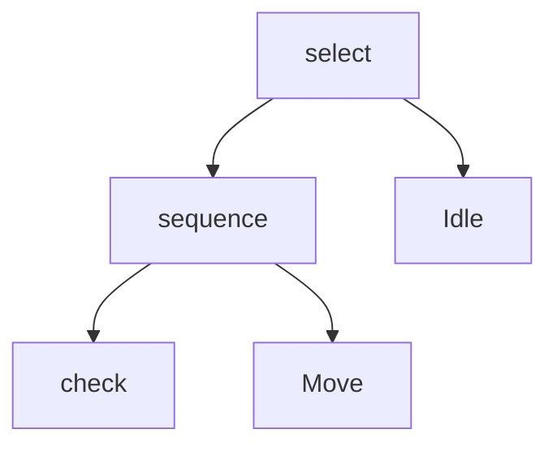
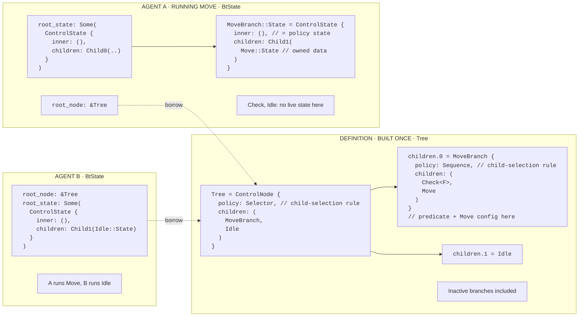

# Tree and state

One shared definition, inline state per agent. Static dispatch, nested Rust
values, no runtime frames.

## Code

```rust,ignore
select((seq((check(can_move), Move)), Idle))
```

```text
MoveBranch = ControlNode<Sequence, (Check<F>, Move)>
Tree = ControlNode<Selector, (MoveBranch, Idle)>
```

`F` = type of `can_move`. `MoveBranch` and `Tree` name concrete node types below.
`Sequence` and `Selector` are policies; their `BtControl::State` is `()`.
Node state is `ControlState<Policy::State, Children::State>`.

## Graph

Familiar node-link view of the same tree:



## Definition vs state

Solid arrows expand inline fields; dashed arrows borrow the shared definition.
Labels are schematic. Rust chooses field offsets and enum layout.



Agent A: root child enum holds `Child0(MoveBranch::State)`; the nested enum
holds `Child1(Move::State)`. Agent B: root child enum holds `Child1(Idle::State)`.
Each agent owns a complete `Option<Tree::State>` and borrows the same definition.

## Layout

- Structs/enums nested inline, one value; no flat array or per-node pointers.
- Child enum: `Empty | Child0(S0) | Child1(S1)`.
- Child size ≈ max(S0, S1) + tag/align.

## During update

- Resume: borrow saved in place. Fresh candidate: temp stack.
- Fresh Running candidate → replace old. Terminal candidate → drop, preserve old.
- Terminal active child → Empty. Terminal root → None.
- User state may heap-alloc.
